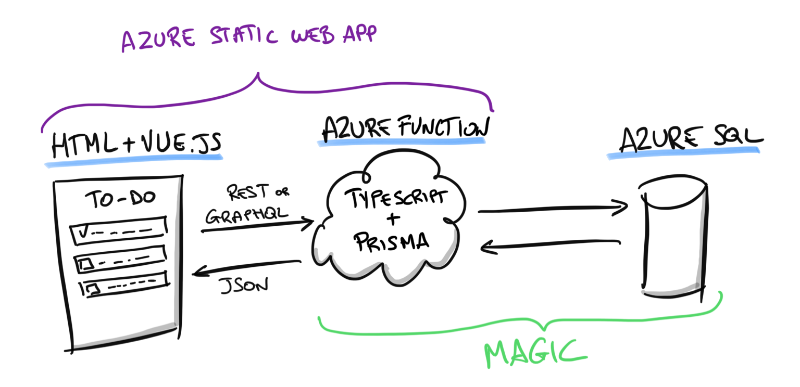
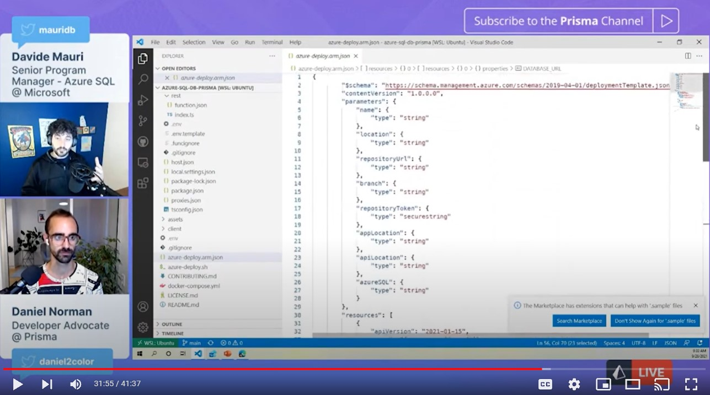

# REST & GraphQL TodoMVC Sample App Full Stack Implementation with Prisma


Serverless Full Stack implementation on Azure of [TodoMVC](http://todomvc.com/) app with support both for REST and GraphQL endpoints via [Prisma](https://www.prisma.io/)

This sample is a variation of the Full-Stack MVC Todo sample described here: [TodoMVC Full Stack with Azure Static Web Apps, Node and Azure SQL](https://devblogs.microsoft.com/azure-sql/todomvc-full-stack-with-azure-static-web-apps-node-and-azure-sql/). The difference, of course, is the use of Prisma to have **a model-first approach and to support both the REST and GraphQL endpoints**.

This means you can use Typescript to query your database and Prisma will take care of generating and executing the correct SQL query. This way you can focus on creating an amazing solution while still having all the power and the features of Azure SQL at your service. Just like magic!



## Azure Static WebApps, Azure Functions, Node and Azure SQL

The implementation uses

- [Azure Static WebApp](https://azure.microsoft.com/en-us/services/app-service/static/): to bind everything together in one easy package, natively integrated with GitHub CI/CD pipeline
- [Vue.Js](https://vuejs.org/) as front-end client
- [Azure Functions](https://azure.microsoft.com/en-us/services/functions/) for providing serverless back-end infrastructure
- [NodeJS](https://nodejs.org/en/) for the back-end logic
- [TypeScript](https://www.typescriptlang.org/) for the back-end logic
- [Prisma](https://www.prisma.io/) to interact with the Azure SQL database
- [Azure SQL](https://azure.microsoft.com/en-us/services/sql-database/) as database to store ToDo data
- [GitHub Actions](https://github.com/features/actions) to Deploy the full-stack website (thanks to Azure Static Web Apps)

## Prisma Meetup Recording

This sample has been presented and discussed in the Prisma Meetup 2021 #8. The recording is available here: 



https://www.youtube.com/watch?v=-u2CwW40X0k

## Folder Structure

- `/api`: the NodeJs Azure Function code used to provide the backend API, called by the Vue.Js client
- `/api/src/functions/rest.ts`: contains the Azure Function that provides REST endpoint support
- `/api/src/functions/graphql.ts`: contains the Azure Function that provides GraphQL endpoint support
- `/api/prisma`: contains the Prisma model
- `/client`: the Vue.Js client. Original source code has been taken from official Vue.js sample and adapted to call a REST or GraphQL client instead of using local storage to save and retrieve todos

## Install the dependencies

Make sure you have [Node](https://nodejs.org/en/download/) installed. Since the free tier of Azure Static Web Apps only supports Node 12, it is recommended to use Node 12 for development too.

Also install the [Azure Function Core Tools v4](https://www.npmjs.com/package/azure-functions-core-tools):

```sh
npm i -g azure-functions-core-tools@4
```

Make sure this dependency is not included in the `package.json` as otherwise the generated package will be too big for Azure Static Web Apps free tier (deployed .zip can max 10MB size).

Also install the [Azure Static Web Apps CLI](https://github.com/azure/static-web-apps-cli):

```sh
npm install -g @azure/static-web-apps-cli`
```

Now you can install the dependencies. Enter the `./api/` folder and install the dependencies:

```sh
npm install
```

then generate the Prisma client:

```sh
npx prisma generate
```

and then build the solution (always from in the `./api` folder):

```sh
npm run build
```

## Create the database

You have two options. If you only want to experiment locally, you can use SQL Server. If you prefer to use the cloud, you can use Azure SQL.

### Option 1 - Start the SQL Server with Docker

If you want to develop locally without any dependency on Azure, you can run SQL Server locally using the included [docker-compose.yaml](./docker-compose.yml) file with the following command:

```sh
docker compose up -d
```

Now use the `/api/.env.template` file to create an `.env` file and add the correct information needed to access your SQL Server.

Create a `.env` file by copying [.env.template](./api/.env.template) inside the [./api](./api) folder, and then add the connection string to connect to the local SQL Server, for example:

```sh
DATABASE_URL=sqlserver://localhost:1433;database=prisma-demo;user=DB_USER;password=DB_PASSWORD;trustServerCertificate=true;encrypt=true
```

### Option 2 - Create the Azure SQL database

> **Beginners:** If you are completely new to Azure SQL, no worries! Here's a full playlist that will help you: [Azure SQL for beginners](https://www.youtube.com/playlist?list=PLlrxD0HtieHi5c9-i_Dnxw9vxBY-TqaeN).

Another option is to use an Azure SQL database also as a development database. If you need to create an Azure SQL database from scratch, an Azure SQL S0 database would be more than fine to run the tests.

Make sure you have an existing Azure SQL server, or create a new one (there is no cost associated with an Azure SQL server). Remember that you can use the [Azure Free offering](https://azure.microsoft.com/en-us/free/sql-database/) if needed:

```sh
az sql server create -g <resource-group> -n <server-name>  -u <admin-user> -p <admin-password> -l <location>
```

make sure you can access the server from your client machine by configuring the firewall:

```sh
az sql server firewall-rule create --server <server-name> -g <resource-group> --start-ip-address <your-ip> --end-ip-address <your-ip> --name MyClient
```

then create the Azure SQL database:

```sh
az sql db create -g <resource-group> -s <server-name> -n todo_prisma --service-objective S0
```

> **Note:** Remember that if you don't have a Linux environment where you can run [AZ CLI](https://docs.microsoft.com/en-us/cli/azure/install-azure-cli?view=azure-cli-latest) you can always use the [Cloud Shell](https://docs.microsoft.com/en-us/azure/cloud-shell/quickstart). If you prefer to do everything via the portal, here's a tutorial: [Create an Azure SQL Database single database](https://docs.microsoft.com/en-us/azure/azure-sql/database/single-database-create-quickstart?tabs=azure-portal).

Prisma will connect to the database using the `DATABASE_URL` environment variable which can be defined in the `./api/.env` file.

Create a `.env` file by copying [.env.template](./api/.env.template) inside the [./api](./api) folder and then define the database URL using the following format:

```sh
DATABASE_URL="sqlserver://DB_SERVER_NAME.database.windows.net:1433;database=DB_NAME;user=DB_USER;password=DB_PASSWORD;encrypt=true;trustServerCertificate=false;loginTimeout=30"
```

## Create the database schema

Now that you have a database, you can create the database schema by using Prisma Migrate:

```sh
npx prisma migrate dev
```

> **Note:** If you run the `prisma migrate dev` command with an Azure SQL database, you will need to also set the connection string for the [shadow database](https://www.prisma.io/docs/concepts/components/prisma-migrate/shadow-database#cloud-hosted-shadow-databases-must-be-created-manually) which is necessary for development purposes. To avoid this you can run instead the `prisma migrate deploy` command which will execute existing migrations without the need for a shadow database.

## Start the local development server

Start the Azure Static Web App server (in the root folder):

```sh
swa start ./client --api-location ./api
```

Enjoy the Static Web Site running locally!

## Running on Azure

This is the amazing part of using Azure Static Web Apps. Deploying to Azure is completely automated via GitHub actions. There are some manual steps because the Static Web Apps CLI is still in Preview at the moment of writing and because Prisma and the Azure Static Web App GitHub Action need some help to get along.

1. Fork this repository
1. Get a [GitHub Token](https://docs.microsoft.com/en-us/azure/static-web-apps/publish-azure-resource-manager?tabs=azure-cli#create-a-github-personal-access-token)
1. Run `./azure-deploy.sh`. Please note that if this is the first time you run it, it will create an `.env` file in the root folder. Fill the `.env` file. Run the `./azure-deploy.sh` again.
1. Once the deployment is done go to the Azure portal, and open the Azure Static Web App resource just created.
1. Open the "Configuration" pane and add a new environment variable named `DATABASE_URL` and assign the value of the database connection string mentioned before in the local development section.
1. Done! Well, not really, read on.

## Fixing generated workflow file

The generated workflow file will not work. Even if the CI/CD pipeline will complete successfully, the Azure Static Web App will not work. This is due to how [Oryx](https://github.com/Microsoft/Oryx), the tool that automates the building and deployment for Static Web Apps, doesn't now how to properly deal with the nuances of Prisma. Fixing this issue is quite easy, just add the following enviroment variable to the workflow.
The workflow file you have to change is in `./github/workflow`. Note the name returned by the deployment script. For example if the deployment script reported that:

```sh
Static Web App created at: gentle-mud-01cd9ba1e.azurestaticapps.net
```

your workflow file will be `./github/workflow/azure-static-web-apps-gentle-mud-01cd9ba1e.yml`.

You can make the requested small change right from your GitHub repository, if you don't want to clone the forked repo locally. Just after the line:

```yaml
###### End of Repository/Build Configurations ######
```

in the "Build and Deploy" step, add these environment variables:

```yaml
    env: # Add environment variables here
      PRE_BUILD_COMMAND: "npm install -g prisma@6.17.1"
      CUSTOM_BUILD_COMMAND: "npm install @prisma/client@6.17.1 && npm run build"
      POST_BUILD_COMMAND: "npm install @prisma/client@6.17.1"
```

Make sure you indent the lines correctly, as requested by YAML syntax, and than commit the change. (If you are using the GitHub online editor, and you don't see any red squiggly lines you should be good to go.)

Take a look at the sample workflow in the `./github/workflow` folder to see what your workflow file should look like.

## Running on Azure (yep!)

After you have commited the changes to the workflow file, the CI/CD pipeline will run again automatically (You can verify it from the "Action" section of your GitHub repo). Once the pipeline has run, you should have a working website. Go to http://[your-swa-name].azurestaticapps.net, and enjoy!

### REST Endpoint

You can create, update and delete ToDos, that are then in turn stored in Azure SQL, completely via REST using the `/api/todo` endpoint. It supports GET, POST, PATCH and DELETE methods. For example using cUrl:

Get all available todos

```sh
curl -s -X GET https://[your-swa-name].azurestaticapps.net/api/todo
```

Get a specific todo

```sh
curl -s -X GET https://[your-swa-name].azurestaticapps.net/api/todo/123
```

Create a todo

```sh
curl -s -H "Content-Type: application/json" -X POST https://[your-swa-name].azurestaticapps.net/api/todo/ -d '{"title":"Hello world"}'
```

Update a todo

```sh
curl -s -H "Content-Type: application/json" -X PUT https://[your-swa-name].azurestaticapps.net/api/todo/123 -d '{"title":"World, hello!", "completed":true}'
```

Delete a todo

```sh
curl -s -X DELETE https://[your-swa-name].azurestaticapps.net/api/todo/123
```

A sample of REST endpoint usage in a web page is available at `/client-rest.html` page.

### GraphQL Endpoint

The GraphQL endpoint is available at `https://[your-swa-name].azurestaticapps.net/api/todo/graphql` and it provides an interactive GraphQL playground. You can create, update and delete ToDos, that are then in turn stored in Azure SQL, completely via GraphQL.

Get all available todos

```graphql
query { 
  todoList { 
    id
    title
    completed 
  } 
}
```

Get a specific todo

```graphql
query { 
  todo(id: 123) { 
    id
    title
    completed 
  } 
}
```

Create a todo

```graphql
mutation { 
  addTodo(title: "hello world") 
  {
    id
    title
    completed
  } 
}
```

Update a todo

```graphql
mutation { 
  updateTodo(id: 123, title: "world, hello") 
  {
    id
    title
    completed
  } 
}
```

Delete a todo

```graphql
mutation { 
  deleteTodo(id: 123) 
  {
    id
    title
    completed
  } 
}
```

A sample of GraphQL endpoint usage in a web page is available at `/client-graphql.html` page.

## Azure Static Web App

Azure Static Web App supports a free tier, but performance may not be what you need. Initial REST API response will be in the 500 msec area. Keep this in mind if you are planning to use them for something other than testing. If you need better performance right now and cannot when for when Azure Static Web App will be out of preview, you can always deploy the REST API using plain Azure Functions where you can have amazing scalability and performance.

### Authentication

The sample supports user authentication via the native Azure Static Web App implementation: [Authentication and authorization for Azure Static Web Apps](https://docs.microsoft.com/en-us/azure/static-web-apps/authentication-authorization)

Each todo item has an associated "ownerId" which is the user who has created that item and only that user can view and operate on that todo. If no user is logged in, only items that belong to the "anonymous" user will be allowed to be created, managed and accessed.
